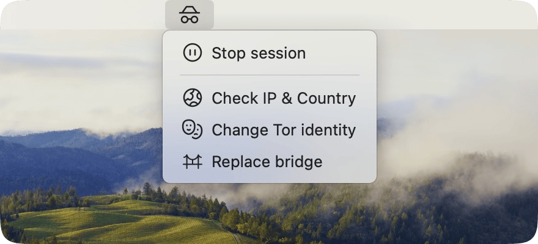

# Tor Toggle for SwiftBar

A SwiftBar plugin to control the Tor service from the macOS menu bar.  
You can start/stop Tor, check your current IP, change your identity, and update your bridge config.



## Features

- Toggle Tor service on/off
- Get current IP address via Tor
- Request a new identity (Newnym)
- Replace obfs4 bridge
- macOS system notifications

## Requirements

- macOS + [SwiftBar](https://swiftbar.app)
- [Tor](https://formulae.brew.sh/formula/tor) installed via Homebrew
- `curl` installed (usually present by default)

## Installation

1. Install Tor via Homebrew: `brew install tor`
2. Download tor-toggle.sh
3. Move it to your SwiftBar plugins directory. Default path: `~/Library/Application Support/SwiftBar/Plugins/`
4. Make it executable: `chmod +x tor-toggle.sh`
5. Check or create torrc file
6. Done! Click the plugin in your menu bar 🎉

## Example torrc

To use this plugin, you need to configure Tor with control and bridge support.  
Here is a sample `torrc` file (located at `/opt/homebrew/etc/tor/torrc`):

```bash
UseBridges 1
ClientTransportPlugin obfs4 exec /opt/homebrew/bin/obfs4proxy
Bridge obfs4 100.0.0... iat-mode=0

SocksPort 9050
Log notice stdout

ControlPort 9051
CookieAuthentication 0
```

Replace the Bridge line with your own bridge obtained from https://bridges.torproject.org, or use the plugin's “Replace Bridge” action.

If the file doesn't exist, create it at: `/opt/homebrew/etc/tor/torrc`

## 🔧 Using with a Browser (via SwitchyOmega)

To route your browser traffic through Tor, you can use the [SwitchyOmega](https://github.com/FelisCatus/SwitchyOmega) extension (available for Chrome and Chromium-based browsers).

### 🛠 Setup

1. Install the SwitchyOmega extension.
2. Open the extension’s options.
3. Create a new profile of type **Proxy**.
4. Set the following values:
   - **Protocol**: `SOCKS5`
   - **Server**: `127.0.0.1` (or `localhost`)
   - **Port**: `9050`
5. Save the profile (e.g., name it `Tor`).
6. Activate the profile — all traffic will now be routed through Tor as long as the profile is enabled.

### 🧠 Smart Proxy Rules

SwitchyOmega also supports **automatic routing rules**, allowing you to choose which websites should go through Tor and which should connect directly. This is super handy for:

- Accessing `.onion` or geo-restricted sites through Tor
- Keeping fast access to trusted services (like YouTube or Google) without Tor latency

You can define rules by domain, URL patterns, or even use external rule lists (like gfwlist or your own custom sets).

### 🧪 How to check if it's working?

- Visit [https://check.torproject.org](https://check.torproject.org) — if everything is set up correctly, you’ll see a message confirming you’re using Tor.
- Alternatively, you can use the built-in button in the SwiftBar plugin to check your current Tor IP.


## Author

[@andreymocco](https://github.com/andreymocco)
